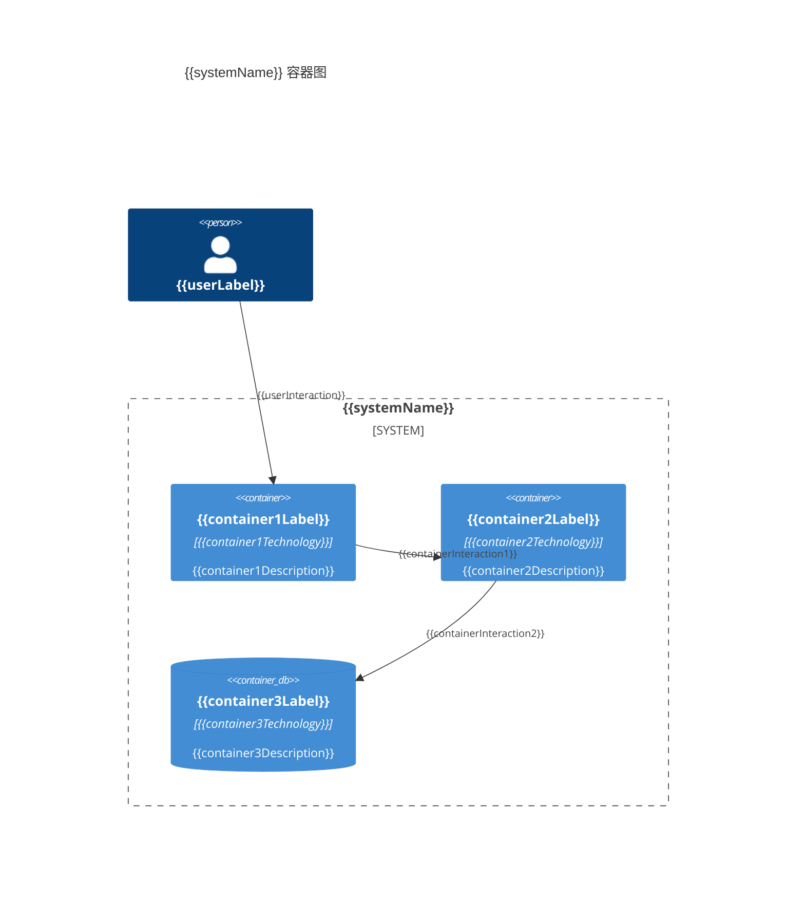

# {{systemName}} 容器图

**创建日期**: {{date}}  
**架构师**: {{architect}}  
**版本**: 1.0

## 概述

容器图（Container Diagram）是 C4 模型的第二层，展示了系统内部的高层次技术构建块（容器）以及它们之间的关系。

## 系统边界

{{systemBoundaryDescription}}

## 容器清单

| 容器名称 | 技术 | 职责 | 状态 |
|---------|------|------|------|
| {{container1}} | {{technology1}} | {{responsibility1}} | {{status1}} |
| {{container2}} | {{technology2}} | {{responsibility2}} | {{status2}} |
| {{container3}} | {{technology3}} | {{responsibility3}} | {{status3}} |

## 容器图

### Mermaid 格式

### Mermaid 文件

参考 [[container-diagram.mmd]]

## 容器交互

### 主要交互流程

1. **{{interaction1}}**: {{interactionDescription1}}
2. **{{interaction2}}**: {{interactionDescription2}}
3. **{{interaction3}}**: {{interactionDescription3}}

### 数据流

{{dataFlowDescription}}

## 技术选型

| 容器 | 技术栈 | 选型理由 |
|------|--------|---------|
| {{container1}} | {{techStack1}} | {{rationale1}} |
| {{container2}} | {{techStack2}} | {{rationale2}} |

## 安全边界

{{securityBoundaryDescription}}

## 相关文档

- [[container-list.md]] - 容器清单
- [[deployment-view.md]] - 部署视图
- [[../01-context/system-context.md]] - 系统上下文图
- [[../03-component/README.md]] - 组件图

## 变更记录

| 日期 | 版本 | 变更内容 | 变更人 |
|------|------|----------|--------|
| {{date}} | 1.0 | 初始版本 | {{architect}} |

