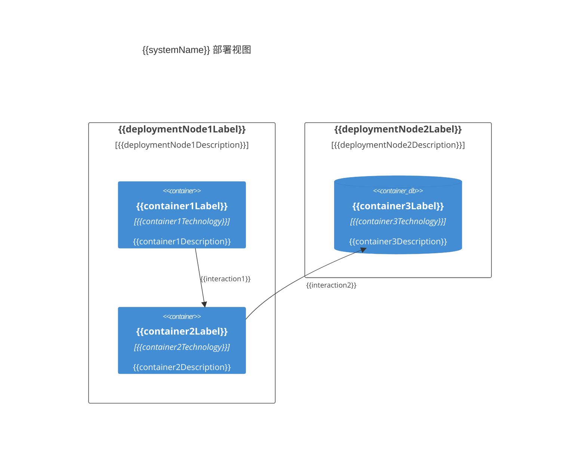

# {{systemName}} 部署视图

**创建日期**: {{date}}  
**架构师**: {{architect}}  
**版本**: 1.0

## 概述

部署视图展示了系统在不同环境中的部署架构，包括基础设施、网络拓扑和容器部署位置。

## 部署环境

### 生产环境

{{productionEnvironmentDescription}}

#### 基础设施

| 组件 | 类型 | 规格 | 数量 | 位置 |
|------|------|------|------|------|
| {{infraComponent1}} | {{infraType1}} | {{spec1}} | {{count1}} | {{location1}} |
| {{infraComponent2}} | {{infraType2}} | {{spec2}} | {{count2}} | {{location2}} |

#### 容器部署

| 容器 | 部署节点 | 实例数 | 资源限制 |
|------|---------|--------|---------|
| {{container1}} | {{deploymentNode1}} | {{instanceCount1}} | {{resourceLimit1}} |
| {{container2}} | {{deploymentNode2}} | {{instanceCount2}} | {{resourceLimit2}} |

### 测试环境

{{testEnvironmentDescription}}

#### 基础设施

| 组件 | 类型 | 规格 | 数量 | 位置 |
|------|------|------|------|------|
| {{testInfraComponent1}} | {{testInfraType1}} | {{testSpec1}} | {{testCount1}} | {{testLocation1}} |

### 开发环境

{{developmentEnvironmentDescription}}

## 网络拓扑

{{networkTopologyDescription}}

### 网络架构图

## 高可用性配置

{{highAvailabilityConfiguration}}

### 负载均衡

{{loadBalancingConfiguration}}

### 故障转移

{{failoverConfiguration}}

## 安全配置

{{securityConfiguration}}

### 网络安全

{{networkSecurityConfiguration}}

### 访问控制

{{accessControlConfiguration}}

## 监控与日志

{{monitoringAndLoggingConfiguration}}

## 备份与恢复

{{backupAndRecoveryConfiguration}}

## 相关文档

- [[container-diagram.md]] - 容器图
- [[container-list.md]] - 容器清单
- [[../04-crosscutting/availability.md]] - 可用性架构

## 变更记录

| 日期 | 版本 | 变更内容 | 变更人 |
|------|------|----------|--------|
| {{date}} | 1.0 | 初始版本 | {{architect}} |

