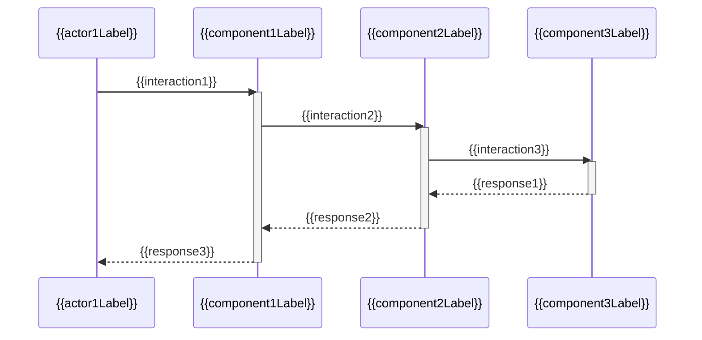
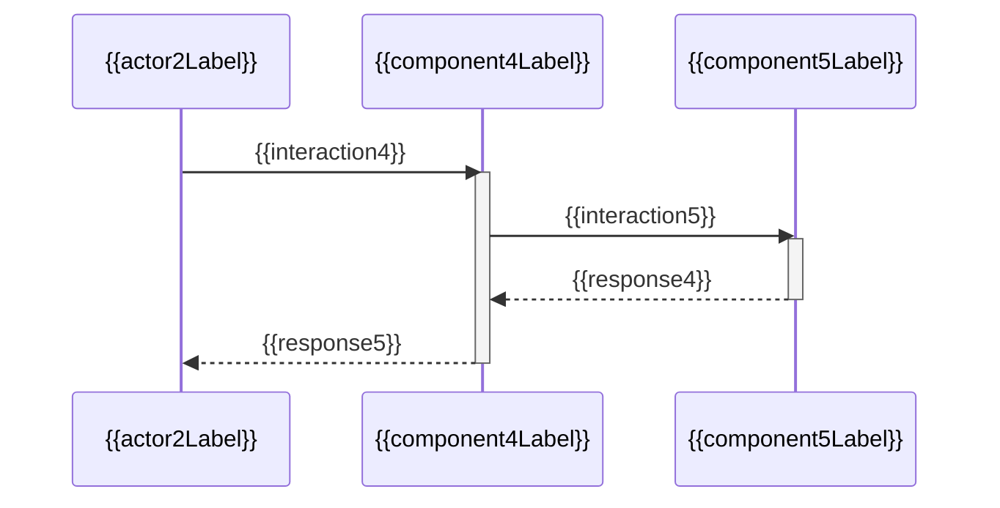
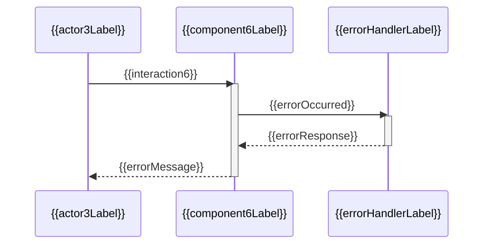

# {{containerName}} 关键序列图

**创建日期**: {{date}}  
**架构师**: {{architect}}  
**版本**: 1.0

## 概述

本文档展示 {{containerName}} 容器中关键业务流程的序列图。

## 序列图列表

### {{scenario1}}

**场景描述**: {{scenario1Description}}

#### 序列图



#### PlantUML 格式

```plantuml
@startuml
{{actor1}} -> {{component1}}: {{interaction1}}
activate {{component1}}
{{component1}} -> {{component2}}: {{interaction2}}
activate {{component2}}
{{component2}} -> {{component3}}: {{interaction3}}
activate {{component3}}
{{component3}} --> {{component2}}: {{response1}}
deactivate {{component3}}
{{component2}} --> {{component1}}: {{response2}}
deactivate {{component2}}
{{component1}} --> {{actor1}}: {{response3}}
deactivate {{component1}}
@enduml
```

#### 说明

{{scenario1Explanation}}

---

### {{scenario2}}

**场景描述**: {{scenario2Description}}

#### 序列图



#### 说明

{{scenario2Explanation}}

---

## 异常处理流程

### {{exceptionScenario1}}

**异常类型**: {{exceptionType1}}  
**处理方式**: {{exceptionHandling1}}



## 相关文档

- [[components.md]] - 组件清单
- [[interfaces.md]] - 接口定义
- [[key-classes.md]] - 关键类说明

## 变更记录

| 日期 | 版本 | 变更内容 | 变更人 |
|------|------|----------|--------|
| {{date}} | 1.0 | 初始版本 | {{architect}} |

