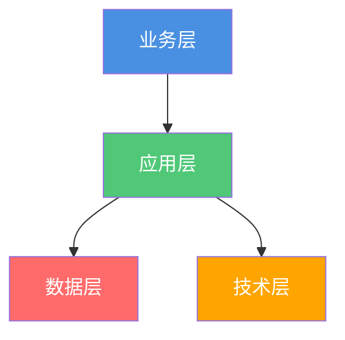

# {{projectName}} 架构定义

**创建日期**: {{date}}  
**架构师**: {{architect}}  
**版本**: {{version}}  
**状态**: {{status}}

## 概述

本文档定义了 {{projectName}} 的架构，包括业务、应用、数据和技术架构。

## 业务架构

{{businessArchitecture}}

## 应用架构

{{applicationArchitecture}}

## 数据架构

{{dataArchitecture}}

## 技术架构

{{technologyArchitecture}}

## 架构图

## 架构决策

{{architectureDecisions}}

## 相关文档

- [[解决方案架构]]
- [[实施计划]]

## 变更记录

| 日期 | 版本 | 变更内容 | 变更人 |
|------|------|----------|--------|
| {{date}} | 1.0 | 初始版本 | {{architect}} |

