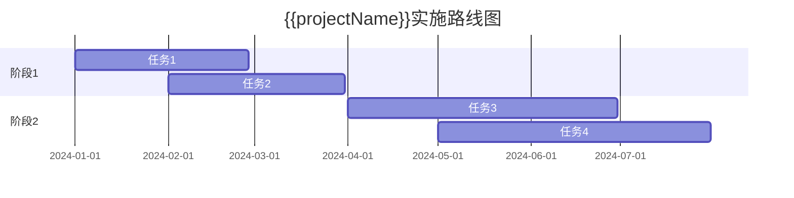

# {{projectName}} 实施计划

**创建日期**: {{date}}  
**项目经理**: {{projectManager}}  
**版本**: {{version}}  
**状态**: {{status}}

## 概述

本文档描述了 {{projectName}} 的实施计划，包括实施阶段、任务分解和资源安排。

## 实施目标

{{implementationObjective}}

## 实施阶段

### 阶段1: {{phase1Name}}

**目标**: {{phase1Objective}}

**时间范围**: {{phase1TimeRange}}

**关键任务**:
- {{task1}}
- {{task2}}
- {{task3}}

**交付物**:
- {{deliverable1}}
- {{deliverable2}}

### 阶段2: {{phase2Name}}

**目标**: {{phase2Objective}}

**时间范围**: {{phase2TimeRange}}

**关键任务**:
- {{task1}}
- {{task2}}
- {{task3}}

**交付物**:
- {{deliverable1}}
- {{deliverable2}}

## 实施路线图

## 资源安排

| 角色 | 人员 | 投入时间 | 职责 |
|------|------|---------|------|
| {{role1}} | {{person1}} | {{time1}} | {{responsibility1}} |
| {{role2}} | {{person2}} | {{time2}} | {{responsibility2}} |

## 风险与应对

### 主要风险

| 风险 | 影响 | 概率 | 应对措施 |
|------|------|------|---------|
| {{risk1}} | {{impact1}} | {{probability1}} | {{mitigation1}} |
| {{risk2}} | {{impact2}} | {{probability2}} | {{mitigation2}} |

## 相关文档

- [[架构定义]]
- [[解决方案架构]]

## 变更记录

| 日期 | 版本 | 变更内容 | 变更人 |
|------|------|----------|--------|
| {{date}} | 1.0 | 初始版本 | {{projectManager}} |

