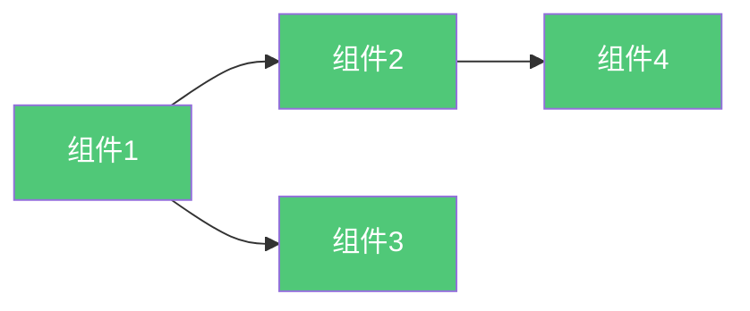

# {{projectName}} 解决方案架构

**创建日期**: {{date}}  
**架构师**: {{architect}}  
**版本**: {{version}}  
**状态**: {{status}}

## 概述

本文档描述了 {{projectName}} 的解决方案架构，包括系统设计、组件交互和部署架构。

## 解决方案概述

{{solutionOverview}}

## 系统设计

### 系统组件

| 组件ID | 组件名称 | 组件描述 | 技术栈 |
|--------|---------|---------|--------|
| COMP-001 | {{component1}} | {{description1}} | {{techStack1}} |
| COMP-002 | {{component2}} | {{description2}} | {{techStack2}} |

### 组件交互

## 部署架构

{{deploymentArchitecture}}

## 非功能性需求

| 需求类型 | 需求描述 | 目标值 |
|---------|---------|--------|
| 性能 | {{performanceRequirement}} | {{target1}} |
| 可用性 | {{availabilityRequirement}} | {{target2}} |
| 安全性 | {{securityRequirement}} | {{target3}} |

## 相关文档

- [[架构定义]]
- [[实施计划]]

## 变更记录

| 日期 | 版本 | 变更内容 | 变更人 |
|------|------|----------|--------|
| {{date}} | 1.0 | 初始版本 | {{architect}} |

